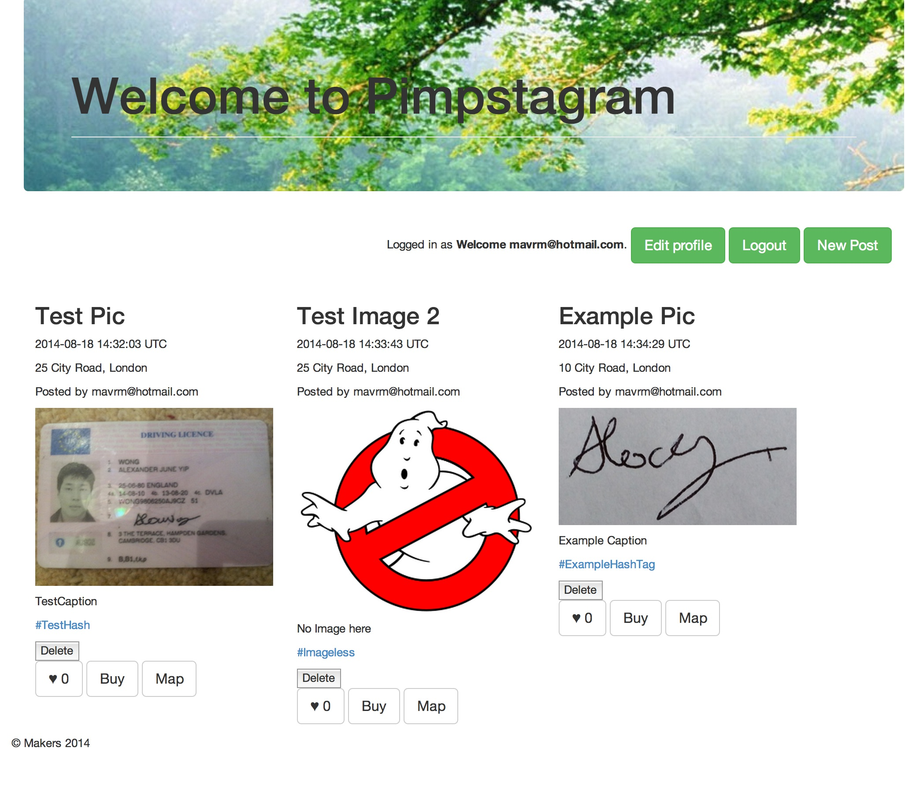

Instagram-Clone
----
This is a sample Instagram clone based on Ruby on Rails in Week 9 at Makers Academy London.

Objectives of exercise
----
Practicing setting up a new app in a Ruby on Rails environment including everything from User, Admin-functions to a payment and mailing system.

What still needs to be done
----
- Polishing frontend
- Add Comments Section

Heroku
----
[Instagram on Heroku]
Technologies used
----
- Ruby
- Ruby on Rails
- Postgresql
- Rspec
- Capybara
- [Devise]
- [Paperclip]
- Amazon Web Services
- Bootstrap
- Git 
- Heroku
- Sendgrid
- Actionmailer
- Stripe
- Websockets
- jBuilder
- Javascript
- AJAX

How to run it
----
```sh
git clone git@github.com:mazzastar/InstagramClone.git
cd InstagramClone
mailcatcher
bin/rails s
```
open your browser and go to localhost:3000

How to test it
----
```sh
cd InstagramClone
rspec
cucumber
```

[Devise]:https://github.com/plataformatec/devise
[Paperclip]:https://github.com/thoughtbot/paperclip
[Instagram on Heroku]:http://serene-headland-3575.herokuapp.com

